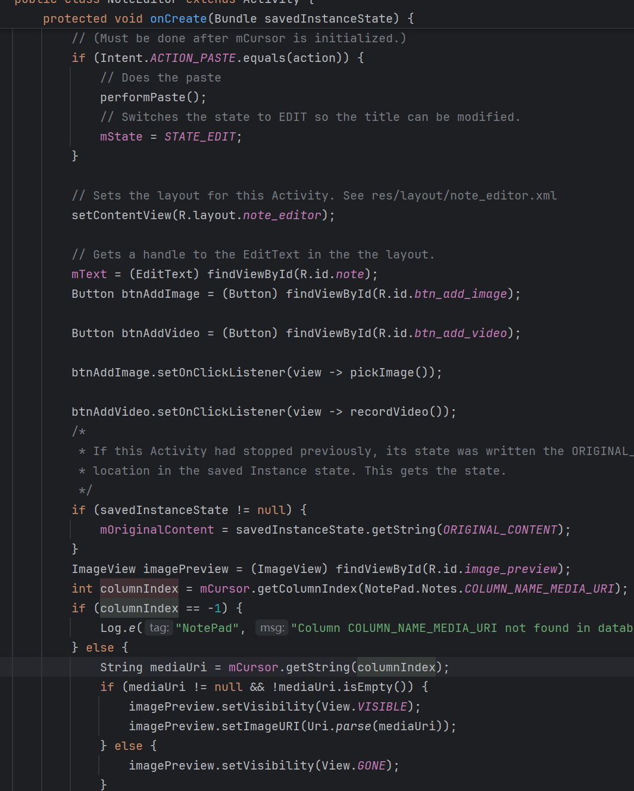

期中项目

基础功能：

时间戳+搜索

时间戳核心代码
](https://github.com/joyier/midproject/blob/13b75214cb5e4659e81752aa031b26cebba18c8f/%E5%B1%8F%E5%B9%95%E6%88%AA%E5%9B%BE%202024-12-08%20120220.png)

附加功能1

ui美化

可以改变背景颜

修改成白色背景

核心代码：

](https://github.com/joyier/midproject/blob/46dad55f664d4930beaa6bc3bac68b22240f8427/%E5%B1%8F%E5%B9%95%E6%88%AA%E5%9B%BE%202024-12-01%20225102.png)

附加功能2：

多类型笔记

在笔记中加入图片，视频

点addimage可以将系统中图片加入笔记

核心代码：](https://github.com/joyier/midproject/blob/bf68ee2ff10209f13eef112497a49c9aebe3161d/%E5%B1%8F%E5%B9%95%E6%88%AA%E5%9B%BE%202024-12-01%20224712.png)

](https://github.com/joyier/midproject/blob/016618df747357100a92c57393c8a1f01fc4c5c9/%E5%B1%8F%E5%B9%95%E6%88%AA%E5%9B%BE%202024-12-01%20224832.png)
